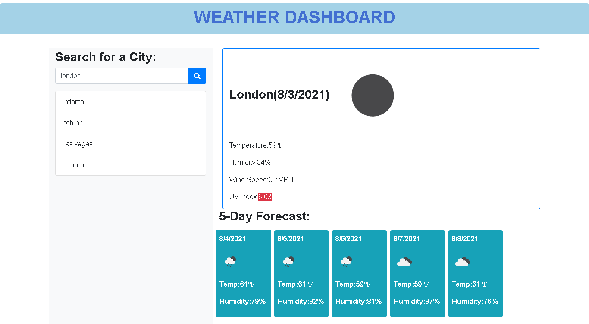

# Weather-Dashboard

## Introduction:

```
when user search for a city the current and future weather conditions for
that city will display as following and that city is added to the search history:
- City name
- Date
- An icon representation of weather conditions
- Temperature
- Humidity
- Wind speed
- UV index
- 5-day forecast
```

The following image shows the web application's appearance and functionality:



## URLs:

- The URL of the deployed application: https://ekhosr.github.io/Weather-Dashboard/

- The URL of the GitHub repository: https://github.com/ekhosr/Weather-Dashboard.git
